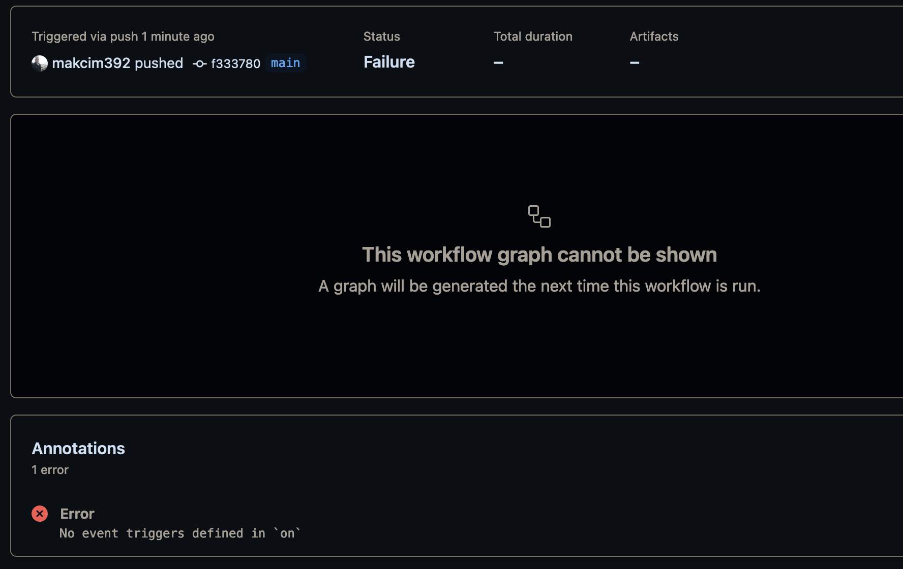

# CI/CD with Github Actions

## Project overview

This is a simple project to demonstrate how to use Github Actions to build and deploy.


## Best practices

## Key steps of the project

1. Create a new repository over the ```./api``` folder from the devops project.
2. Go into actions section in Github and click on ```setup a workflow yourself```.
3. There will be a .yml file created in the ```./github/workflows``` folder.



# Lessons learned

## Mistakes on docker file locations

I've originally included the docker files inside the parent folder (```./devops```) which was a mistake, since I'd be going to commit to the CI/CD repository only the ```./api``` folder.

That generated some issues, as I had to re-adapt the file paths in the docker files to match the new location.

# Key takeaways

- Make sure to set the indent spaces correctly in the .yml file, otherwise it will not work. The standard is 2 spaces.


## On statement and triggering pipeline

In case there is no ```on:``` statement in the .yml file, the pipeline will not be triggered. This is useful in case you want to create a pipeline but not trigger it automatically.


Under the hood, the on statement uses a Github Webhook to trigger the pipeline. This is why it is important to have the .yml file in the ```./github/workflows``` folder, otherwise it will not work.